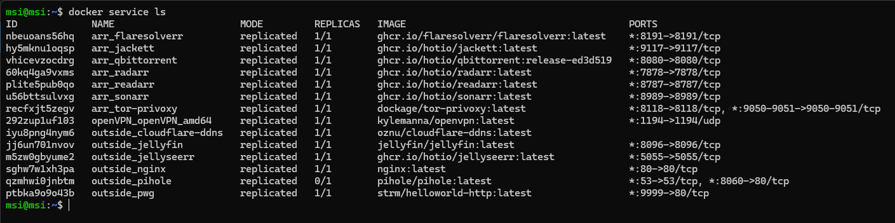
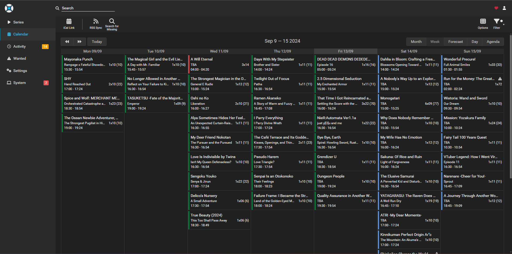

# Docker Swarm Server Setup

This repository guides you through setting up a Docker Swarm cluster. It allows you to manage a pool of Docker hosts as a single system, providing failover and load balancing across containers. Server gives you possibility manage private jellyfin Streaming platform to be up to date with your favorite series and films.
To get access to each site you need be inside local network, and use corresponding port set up in .env.


It's created to be in different virtual networks, and gives as little access from outside of local network.

Example of finnished setup:


## Table of Contents

1. [Prerequisites](#prerequisites)
2. [Creating a Swarm Cluster](#creating-a-swarm-cluster)
3. [Adding Worker Nodes](#adding-worker-nodes)
4. [Configure environment](#configure-environment)
5. [Deploying Services to Swarm](#deploying-services-to-swarm)
6. [Optional](#optional)
7. [Final Result](#final-result)
8. [License](#license)
---

## Prerequisites

Before you begin, ensure you have the following:

- **Docker** installed on all servers.
- At least two or more machines (physical or virtual).
- **SSH access** to each machine.
- Owning domain.
- Admin access to router.

## Creating a Swarm Cluster

1. Initialize the Swarm Manager Node:
    On the machine you want to use as the manager node, run:

    ```bash
    docker swarm init --advertise-addr <MANAGER_IP>
    ```

    Replace <MANAGER_IP> with the IP address of your manager node.
    The output will provide a command to join the worker nodes to this Swarm cluster.

## Adding Worker Nodes

1. Get join token for worken:
    On the machine you want to use as the manager node, run:

    ```bash
    docker swarm join-token worker
    ```

2. Join worker nodes:
    On the machine you want to use as the worker node, paste output:

    ```bash
    docker swarm join --token <TOKEN> <MANAGER_IP>:2377
    ```

## Configure environment

1. configure local.env to your parameters:

    ```bash
    CLOUDFLARE_DDNS_API_KEY='your_cloudflare_api_key'
    CLOUDFLARE_ZONE="yourdomain.it"
    PIHOLE_PASSWORD=pihole
    ```

2. rename local.env to .env:

    ```bash
    mv local.env .env
    ```

3. configure swarm nodes to given roles:

    ```bash
    docker node update <NODE_NAME> --label-add role=cpu=amd64
    docker node update <NODE_NAME> --label-add role=cpu=arm64
    docker node update <NODE_NAME> --label-add role=cpu=jellyfin
    docker node update <NODE_NAME> --label-add role=cpu=tdarr
    ```

## Deploying Services to Swarm

1. On manager start "arr" group:

    ```bash
    ./start_stack_arr.sh 
    ```

    it will start first group of services: **sonarr**, **radarr**, **readarr**, **qbittorrent**, **jackett**, **tor-privoxy**, **flaresolverr**

2. On manager start "outside" group:

    ```bash
    ./start_stack_outside.sh 
    ```

    it will start second group of services: **jellyfin**, **jellyseerr**, **pihole**, **cloudflare-ddns**, **nginx**

## Optional

1. On manager start "openVPN" group:

    ```bash
    ./start_stack_openVPN.sh 
    ```

    it will start optional **openVPN** server which allows connect to local network and be able to configure from outside.

## Final Result





## License

This project is licensed under the MIT License. You are free to use, modify, and distribute this project for educational purposes.